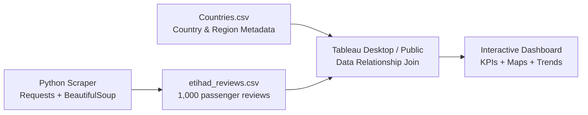

# Etihad Airways Reviews Analysis

A data analytics project that scrapes, cleans, and analyzes customer reviews for Etihad Airways to uncover insights into passenger satisfaction, cabin service, seat comfort, and value for money across different travel classes and aircraft models.

[](https://python.org)
[](https://www.crummy.com/software/BeautifulSoup/)
[](https://public.tableau.com)
[](https://pandas.pydata.org)

**[Live Dashboard](https://public.tableau.com/app/profile/jayansh.jain)** · **[Scraper Script](etihad_scraper.py)** · **[Reviews Dataset](etihad_reviews.csv)**

---

## What This Project Does

This project simulates a typical data analyst workflow: crawling unstructured passenger review text from the web, cleaning and structuring it programmatically, joining it with regional metadata, and building a professional interactive visualization dashboard.

The analysis answers five business questions:
1. How does passenger satisfaction (overall rating) trend month-over-month and year-over-year?
2. Which service elements (seat comfort, cabin staff, food, ground service, value) show the greatest strengths or weaknesses?
3. How do customer ratings vary geographically by region, continent, and country?
4. Which aircraft models in the fleet receive the highest and lowest comfort ratings?
5. How does passenger satisfaction differ across seat classes (Economy, Business, First, Premium Economy)?

---

## Architecture



---

## Results and Insights

**Data Cleansing Impact:** In the raw scraping phase, passenger reviews with missing values in optional categories (such as Ground Service or Inflight Entertainment) are captured as true empty cells (NULLs). Programmatically handling these missing entries prevents the artificial deflation of average scores, ensuring that calculated averages reflect actual customer responses.

**Fleet Performance Dynamics:** Reviews reveal clear differences between short-haul and long-haul aircraft configurations. High-capacity widebody models (such as the Airbus A380 and Airbus A350-1000) consistently lead in seat comfort and cabin service ratings. Conversely, narrowbody aircraft (such as the Airbus A320) deployed on regional routes receive lower satisfaction scores, primarily driven by criticisms of legroom and reduced amenities.

**Geographic Satisfaction Trends:** Joining the passenger data with country metadata reveals that average ratings differ significantly by region. Passengers boarding from European and Asian hubs report higher satisfaction rates on average than passengers flying routes with multi-leg connections.

---

## Project Structure

```
Airways-Analysis-main/
│
├── Countries.csv                 # Helper country metadata for geographic grouping
├── etihad_reviews.csv            # 1,000 scraped passenger reviews of Etihad Airways
├── etihad_scraper.py             # Python crawler using requests and BeautifulSoup
├── .gitignore                    # Git exclude patterns
└── README.md                     # Project documentation and setup guide
```

---

## Tech Stack

| Layer | Tool | Purpose |
|---|---|---|
| Data Collection | Python (requests, BeautifulSoup) | Crawls raw HTML review feeds, parses key metrics, and implements rate-limiting delays |
| Data Cleaning | Pandas | Handles date parsing, strips boilerplate prefixes, and enforces data integrity (storing missing ratings as true nulls) |
| Geography Mapping | Countries Metadata | Maps passenger locations (`place`) to ISO codes, regions, and continents |
| Visualization | Tableau Public | Implements dynamic parameters, global filters, map actions, and dynamic dashboard headers |

---

## Running the Scraper

To update the dataset or fetch the latest reviews yourself, configure your Python environment and run the script:

**Install dependencies:**
```bash
pip install requests beautifulsoup4 pandas
```

**Execute the crawler:**
```bash
python etihad_scraper.py
```
The script crawls Skytrax, fetches the 1,000 most recent passenger reviews for Etihad Airways, cleans formatting artifacts, and overwrites `etihad_reviews.csv`.

---

## Contact

**Jayansh Jain** — [GitHub](https://github.com/Jayansh21) · [LinkedIn](https://www.linkedin.com/in/jayansh1021/) · jjayansh1021@gmail.com
